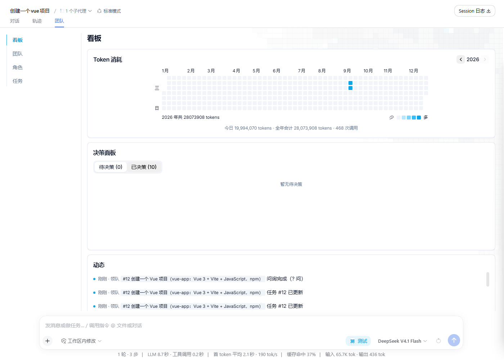
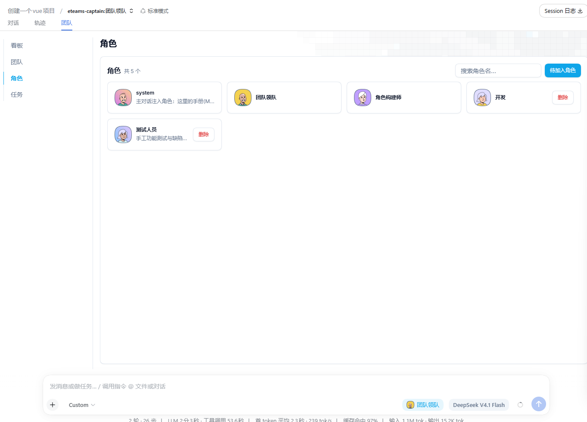
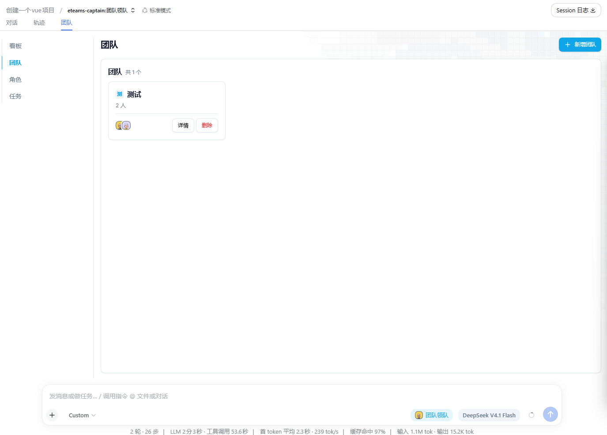
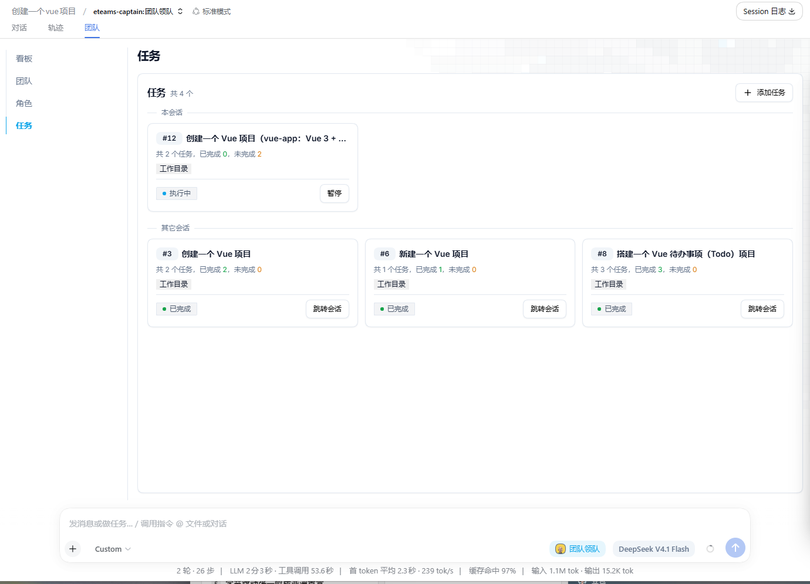
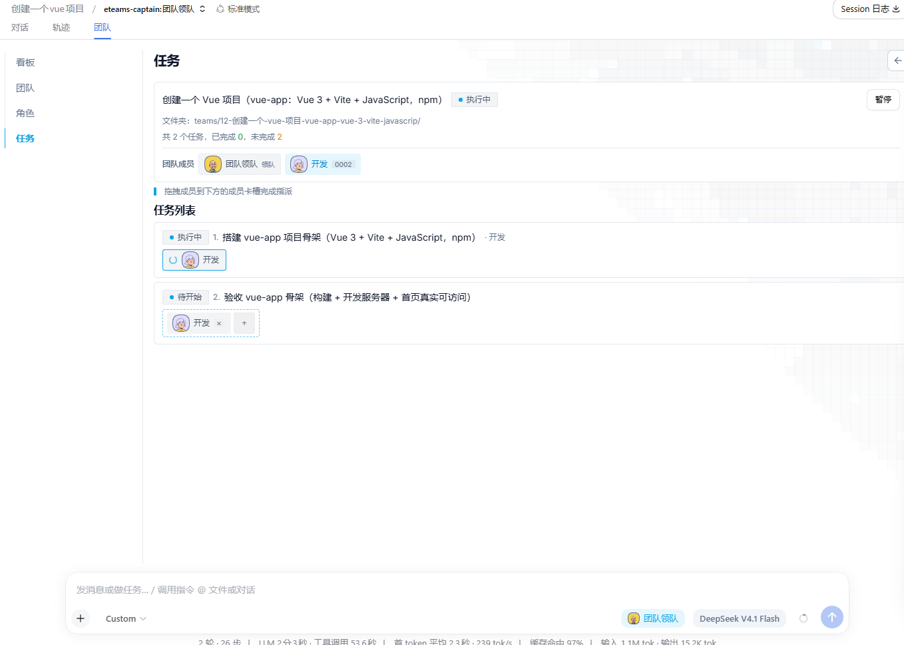

<div align="center">


# ETeams

**让 AI 组成一支真正的团队。**

领队拆解目标，成员接力执行 —— DeepSeek Harness 的多智能体团队协作插件。

[](package.json)
[](LICENSE)
[](package.json)
[](https://github.com/deepseek-ai)

</div>


## 这是什么

ETeams 给 DeepSeek Harness 装上「一支团队」：你把目标丢给**领队**，领队把目标拆成任务、按**执行链**派给**成员**，每个成员在自己的子会话里独立干活，进度、失败、决策实时可见。

不是「一个大模型假装多个人」，而是真实的多会话协作，你可以自由调度成员，并给每个成员不同的模型。

- **包名** `dsh-eteams`，插件 id `eteams`，双端单包（宿主端 + 浏览器端）。
- **自包含**：构建产物已内联全部依赖，无运行时安装负担；状态存本机 SQLite（内置 `node:sqlite`），不联网、不上传。

## 三步上手

| 步骤         | 做什么                                                                  |
| ------------ | ----------------------------------------------------------------------- |
| **1 · 添加成员** | `/eteam` 面试式生成角色手册，落进全局角色库 —— 每个角色就是一张岗位卡。 |
| **2 · 组件团队** | 面板「团队」页从角色库挑人进班子，指定一人为领队。                      |
| **3 · 创建任务** | 对话里说清目标 → 领队拆解、你批准 → 自动派发执行，全程在面板围观。      |

## 界面





## 安装

**方式一：插件市场（推荐）**

在 DeepSeek Harness 插件市场搜索 **ETeams**，一键安装后重启应用。

**方式二：命令行**

```bash
dsh plugin --profile desktop add dsh-eteams
```

**方式三：本地源码（开发调试）**

```bash
git clone https://github.com/2507483326/dsh-eteams.git && cd dsh-eteams
pnpm install && pnpm build
dsh plugin --profile desktop add .
```

安装后核对装配结果，并重载客户端：

```bash
dsh --profile desktop --dump-config
```

